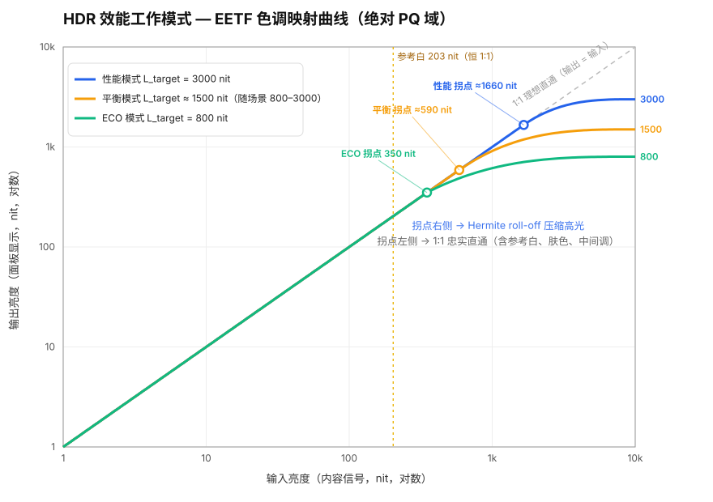

# 电视 HDR 效能工作模式 — PQ 策略设计

> 对应产品定义的三种模式：**性能模式 / 平衡模式 / ECO 模式**
> 适用输入：HDR10（PQ / ST 2084 + ST 2086 静态元数据），可扩展到 HDR10+ / Dolby Vision / HDR Vivid
> Tone mapping 框架：ITU-R BT.2390 EETF（显示端亮度适配的行业标准做法）

---

## 术语与缩写对照表

### 标准与传递函数

| 术语 | 英文全称 | 含义 |
|---|---|---|
| **PQ** | Perceptual Quantizer（感知量化器） | SMPTE ST 2084 定义的 HDR 传递函数。绝对亮度体系：码值直接对应显示亮度（nit），上限 10,000 nit。HDR10/HDR10+/Dolby Vision 的基础 |
| **ST 2084** | SMPTE ST 2084 | PQ EOTF 的标准文件编号，与 "PQ" 常互换使用 |
| **ST 2086** | SMPTE ST 2086 | HDR 静态元数据标准：记录母版监视器色域、白点、最大/最小亮度（MDL） |
| **EOTF** | Electro-Optical Transfer Function（电光转换函数） | 显示端：视频信号 → 屏幕亮度的解码曲线 |
| **OETF** | Opto-Electronic Transfer Function（光电转换函数） | 拍摄端：场景光 → 视频信号的编码曲线 |
| **EETF** | Electrical-Electrical Transfer Function（电-电转换函数） | 信号→信号的重映射曲线，即 tone mapping 在 PQ 码值域的数学形式。本文核心工具 |
| **BT.2390** | ITU-R BT.2390 | ITU 的 HDR 制作/显示适配报告，定义了本文使用的 EETF（拐点 + Hermite 样条）参考公式 |
| **BT.2408** | ITU-R BT.2408 | HDR 制作操作实践指南，规定 **203 nit 参考白** |
| **BT.2020** | ITU-R BT.2020 | 超高清广色域色彩空间（HDR 内容的标准色域容器） |
| **HLG** | Hybrid Log-Gamma（混合对数伽玛） | 另一种 HDR 传递函数（BT.2100），相对亮度体系，广播常用。本文以 PQ 为主 |
| **Tone Mapping** | — | 色调映射：把母版亮度范围压缩/适配到显示器实际能力的过程 |
| **拐点** | Knee | 曲线上 1:1 直通区结束、高光开始压缩的位置。本文正文一律称"拐点"，其 PQ 码值记作符号 **KS**（见设计变量） |
| **Roll-off** | — | 拐点之后的渐进压缩坡段（相对"硬剪切"而言，保留高光层次） |
| **Hermite 样条** | Hermite Spline | BT.2390 用于 roll-off 段的三次插值多项式，保证曲线平滑无断点 |

### 元数据与内容统计

> **本设计不把元数据当作曲线输入。** MaxCLL/MaxFALL/MDL 精度不保证，且 HDMI 通路常缺失或不可靠。曲线一律工作在**绝对 PQ 码值域**（信号本身准确），下列元数据仅作平衡/ECO 模式预算的**可选参考**，缺失时用本机硬件实测统计（FALL_frame / P99.9 / A_hl）替代。

| 术语 | 英文全称 | 含义 |
|---|---|---|
| **MaxCLL** | Maximum Content Light Level | 整部内容中最亮单像素的亮度（nit），HDR10 静态元数据。仅作可选参考 |
| **MaxFALL** | Maximum Frame-Average Light Level | 整部内容中"帧平均亮度"的最大值（nit），HDR10 静态元数据。仅作可选参考 |
| **MDL** | Mastering Display Luminance | 母版监视器的最大/最小亮度（来自 ST 2086）。仅作可选参考，**不作为曲线归一化依据** |
| **FALL_frame** | Frame-Average Light Level | 单帧的平均亮度（本机硬件逐帧统计，非元数据） |
| **P99.9** | 99.9th Percentile | 单帧亮度直方图的第 99.9 百分位值 ≈ 排除少量噪点后的"有效峰值"（本机实测） |
| **A_hl** | Highlight Area ratio | 高光面积占比：亮度超过阈值（本文取 500 nit）的像素占全屏比例（本机实测） |

### 本文设计变量

| 变量 | 含义 |
|---|---|
| **V** | 解码得到的**绝对 PQ 码值** ∈ [0,1]，V=1 对应 10,000 nit。就是 HDMI/文件里实际传输的信号本身，无需元数据 |
| **L_target** | 高光预算：当前模式允许呈现的最高显示亮度（nit）。三种模式的唯一分叉变量，也是曲线的唯一显示端输入 |
| **L_eco_cap** | ECO 模式的高光预算上限 |
| **Vpeak** | 目标峰值的绝对 PQ 码值 = PQ(L_target)。来自面板/模式，**准确**，不依赖内容元数据 |
| **KS** | 拐点的 PQ 码值坐标（0–1 之间）。就是上面的"拐点"，公式 KS = 1.5×Vpeak − 0.5（第 2 节有推导） |

### 显示硬件

| 术语 | 英文全称 | 含义 |
|---|---|---|
| **nit** | = cd/m²（坎德拉每平方米） | 亮度单位，1 nit = 1 cd/m² |
| **FALD** | Full-Array Local Dimming（全阵列局部调光） | LCD 背光按分区独立控制亮度的技术 |
| **Local Dimming** | 局部调光 | 按画面内容分区控制背光，提升对比度 |
| **Halo（光晕）** | — | FALD 副作用：亮物体周围因背光分区大于物体而出现的泛光 |
| **ABL** | Automatic Brightness Limiter（自动亮度限制） | 大面积高亮时自动压低整屏亮度，保护功耗/器件（OLED 尤为明显） |
| **Duty** | Duty Cycle（占空比） | 背光 PWM 驱动的开通比例，100% = 恒定全开 |
| **@10% 窗口** | 10% Window | 测试图形：屏幕中央 10% 面积的白块。面板小面积峰值亮度的标定条件 |
| **LUT** | Look-Up Table（查找表） | 预计算的映射表，硬件逐像素查表代替实时计算 |
| **1D LUT** | One-Dimensional LUT | 单通道独立映射的查找表（本文 EETF 的实现形式） |
| **HGiG** | HDR Gaming Interest Group | 游戏 HDR 约定：电视不做 tone mapping，把显示能力告知主机、由游戏端直接按能力渲染 |
| **EDR** | Extended Dynamic Range | Apple 的 HDR 表示与渲染体系：线性浮点值域，1.0 = 参考白，>1.0 到 headroom 直通、超出裁切。**headroom = 峰值/参考白**（§4.4 的"高光系数"同义） |
| **PWM** | Pulse-Width Modulation（脉宽调制） | 背光亮度控制方式之一 |
| **attack / release** | — | 时域滤波参数：数值变大（变亮）/变小（变暗）时的响应时间常数 |

---

## 0. 设计基线（三种模式共同遵守）

| 基线项 | 规定 | 理由 |
|---|---|---|
| 参考白锚点 | **203 nit（BT.2408）在三种模式下亮度观感一致**（容差 ±5%）；用户调低亮度时按 §4.4 的 f(B) 等比缩放，三模式仍一致 | 模式切换时 UI、字幕、肤色、SDR 图形不能跳变 |
| PQ 忠实区间 | 满亮度（B=1）时从黑位到拐点 1:1 跟随 PQ 码值；用户调光时线性区斜率 = f(B)（§4.4，参考白等比变暗、不再 1:1） | PQ 是绝对亮度体系，中低亮度是创作意图核心；调光属用户意图，另论 |
| 高光处理 | 拐点以上用 BT.2390 Hermite 样条 roll-off，**不硬剪切** | 保留高光层次，避免大面积白斑 |
| 色度策略 | 高光压缩在 RGB max（保色相）域计算，roll-off 末端允许渐进去饱和 | 防止压缩后色相偏移（橙变黄） |
| 面板假定 | **峰值 3,000 nit @10% 窗口 / 1,000 nit 全屏**，FALD 背光，黑位 0.005 nit | 参数表按此标定，其他面板按比例缩放 |
| 不依赖元数据 | 曲线只用**绝对 PQ 码值** + 显示端已知量（L_target），**不使用** MaxCLL/MDL 归一化 | 元数据不准、HDMI 常缺失；PQ 信号本身是准确的绝对亮度 |
| 黑位不介入 | 公共曲线只做高光 roll-off，拐点以下（含纯黑、暗部）完全 1:1，不做 black lift | PQ 暗部码值已充足，抬黑损失对比度；物理黑位交硬件呈现 |
| 直通自然涌现 | 拐点落在 ~1,660 nit（性能模式），任何实际亮度 ≤ 拐点的像素自动 1:1 | 无需知道母版峰值——低于拐点的内容天然忠实呈现，高于拐点才 roll-off |

**核心思想：三种模式的区别只在"高光预算" `L_target` 的决定方式，pipeline 和曲线公式完全共用；曲线在绝对 PQ 域工作，与内容元数据解耦。**

---

## 1. 三种模式 PQ 策略总览

| 维度 | 性能模式 (Performance) | 平衡模式 (Balanced) | ECO 模式 |
|---|---|---|---|
| **L_target（高光预算）** | 恒定 = 面板峰值（3,000 nit） | 逐场景自适应，范围 [800, 3000] nit | 恒定 800 nit（实测：高光 ≥800 nit 才有明显 HDR 观感）或功率预算反解，下限 800 |
| **背光策略** | 恒定最高 + local dimming 增强 | 内容自适应（跟随 L_target） | 功率上限封顶（如额定 60%） |
| **PQ 1:1 跟随上限（拐点）** | **≈1,660 nit**（内容亮度 ≤ 拐点全部 1:1，覆盖几乎所有 1000 nit 母版） | 随 L_target 动态，约 [225, 1660] nit | **350 nit**（显式抬高护参考白） |
| **203 nit 参考白** | 1:1 | 1:1 | 1:1（在拐点之下，必须保证） |
| **时域行为** | 静态（无亮度调整延迟） | attack 120 ms / release 800 ms / 场景切换瞬时 | 静态 |
| **光晕（halo）** | 最大（背光全开） | 中（高光小面积时主动压 L_target） | 最小 |
| **功耗** | 最高 | 中 | 受硬上限约束 |
| **优点** | 高亮实时性最好，冲击力最强 | 光晕/功耗/亮度三者折中 | 省电、光晕小、观感稳定 |
| **缺点** | 光晕大、功率高、ABL 介入风险 | 亮度变化实时性有损（靠时域滤波掩盖） | 高光冲击力弱 |

---

## 2. 公共曲线框架：BT.2390 EETF 参数化

所有模式共用同一条参数化曲线，**直接在绝对 PQ 码值域**进行——不做以内容峰值为分母的归一化，因此完全不依赖元数据：

```
输入: V   — 解码得到的绝对 PQ 码值 ∈ [0,1]（V=1 对应 10,000 nit）
             这就是 HDMI / 文件里实际传输的信号本身，无需任何元数据

显示端已知量（准确，来自面板与模式，非内容元数据）:
      L_target — 本模式高光预算（nit）

绝对 PQ 锚点（PQ() = ST 2084 inverse EOTF，nit → 码值）:
  Vpeak = PQ(L_target)          // 目标峰值码值

拐点（BT.2390，绝对 PQ 域）:
  KS = 1.5 × Vpeak − 0.5
  // 护参考白：若 KS 对应亮度低于 203 nit×余量，则抬高到 KS_floor = PQ(350)  // 350 nit 对应码值
  //           （高 L_target 时 KS 自然高于此值，floor 不生效；仅 ECO 等低预算触发）
  KS = max(KS, KS_floor)

高光 roll-off，对 V ∈ [0,1]:
  m0 = min(1 − KS, 3 × (Vpeak − KS))          // 起点切线，钳制保证单调（见下方说明）
  V ≤ KS:  V′ = V                             // 1:1 忠实区（黑位、暗部、参考白、肤色、中间调全部原样）
  V > KS:  V′ = P(t),  t = (V − KS)/(1 − KS)  // Hermite 样条
     P(t) = (2t³−3t²+1)·KS + (t³−2t²+t)·m0 + (−2t³+3t²)·Vpeak
  // 把 [KS, 1]（即拐点 10,000 nit）压进 [KS, Vpeak]（即拐点 L_target）

输出亮度 = PQ_EOTF( V′ )         // 直接绝对 PQ 解码，不再乘 PQ(L_src_peak)
```

> **⚠ 单调性钳制（`m0`）——务必保留。** BT.2390 原式起点切线固定为 `1 − KS`，只在 KS 未被抬高时安全。当 `KS_floor` 把拐点抬高（**仅 ECO 触发**），压缩区在 PQ 码值上被压得极窄（ECO：0.638 → 0.728，仅 0.090），而固定斜率 1 的样条会**过冲**——曲线先超过 L_target 再回落，表现为"输入越亮、显示反而越暗"，是严重错误。将起点切线钳到 `min(1−KS, 3(Vpeak−KS))` 即可保证单调：性能/平衡模式下两项恰好相等（BT.2390 系数 1.5 的作用），钳制不改变行为；ECO 下取后者，拐点处斜率降到约 0.74（轻微软拐，对强压缩模式合理）。

### 读懂 `KS = 1.5 × Vpeak − 0.5`

这是 BT.2390 给出的**拐点位置经验公式**，全部量都在同一根 0–1 的 PQ 码值轴上（0 = 黑，1 = 10,000 nit）：

- **Vpeak** = 面板能显示的峰值（L_target）在这根轴上的码值。面板越亮，Vpeak 越接近 1。
- **KS** = 拐点在这根轴上的码值，即"1:1 直通到此为止，再往上开始压缩"。

公式的意思是：**拐点不是固定的，而是跟着面板峰值走。** 把它换个写法更直观——

```
1 − KS = 1.5 × (1 − Vpeak)
```

即「压缩区的宽度」= 1.5 ×「面板峰值离满量程（10,000 nit）还差多少」。

- 面板峰值离 10,000 nit 差得越远（Vpeak 越小）→ 压缩区越宽 → 拐点越靠左，要更早开始压高光。
- 面板峰值 = 10,000 nit（Vpeak = 1）→ 压缩区宽度 = 0 → 拐点顶到最右，全程 1:1，无需任何压缩。

系数 1.5 是 BT.2390 选定的经验值：让压缩坡比"缺口"再长 50%，roll-off 有足够长度平滑过渡、不显生硬。

**代入本机数值（性能模式，L_target = 3,000 nit）：**

| 量 | 码值 | 对应亮度 |
|---|---|---|
| Vpeak = PQ(3000) | 0.872 | 3,000 nit |
| KS = 1.5×0.872 − 0.5 | 0.808 | ≈ 1,660 nit |
| 满量程 | 1.000 | 10,000 nit |

结论：输入信号中 **≤ 1,660 nit 的部分原样直通**；**1,660 → 10,000 nit 的高光被压进 1,660 → 3,000 nit** 输出。

### 一图看懂三种模式



看图三个要点：① 拐点左侧三条线重合在对角线上——中低亮度所有模式完全一致、忠实直通；② 拐点位置随 L_target 左右移动，峰值越高拐点越靠右、直通区越大；③ 拐点右侧各自 roll-off 到 L_target 后封顶，ECO 压得最狠、性能保留最多高光。

---

**只动高光，不碰黑位。** 曲线仅在拐点以上弯曲，拐点以下（含纯黑、暗部）完全 1:1。**不做黑位提升（black lift）**——PQ 暗部码值本已充足，人为抬黑只会提亮纯黑、损失对比度；面板物理黑位交由硬件呈现，信号域不介入。

**这个改动的关键：** 数学上等价于把源峰值固定为 PQ 满量程（10,000 nit）。因为不再猜内容峰值，roll-off 从拐点起就为"内容可能冲到 10,000 nit"预留了余量；而任何**实际**亮度低于拐点的像素都落在 1:1 区——**直通不再是依赖元数据的显式分支，而是曲线的自然结果**。

**实现注意**
- 曲线仅依赖 `L_target` 一个**显示端**变量 → 可预计算成 1D LUT（1024 点），由面板/模式给定，准确且更新缓慢。
- **快路径**：本机实测 P99.9 ≤ 拐点时，被用到的 LUT 区段就是恒等映射，等效直通，可跳过查表。3,000 nit 面板上，1000 nit 内容天然走此路径。
- 平衡模式 L_target 逐帧变化时，只在两条相邻预算的 LUT 间插值，**不改背光/面板补偿之外的任何链路**。
- `KS_floor` 由参考白保护反推：取拐点下限 = 350 nit（PQ 码值 ≈ 0.638），保证 203 nit（码值 0.581）恒在 1:1 区。

---

## 3. 处理流程（Pipeline）

```
HDR10 码流
  │
  ①解码 → 10bit 绝对 PQ 码值 V (BT.2020)   ←—— 曲线的唯一像素输入
  │
  ②元数据解析（可选，仅供参考，不进曲线）
  │   MaxFALL / MaxCLL 若存在 → 平衡/ECO 预算的辅助参考
  │   缺失（如 HDMI 无 InfoFrame）→ 完全依赖③的实测统计，不影响曲线
  │
  ③帧统计（硬件 histogram，每帧，绝对 nit）
  │   FALL_frame（帧平均亮度）
  │   P99.9（第 99.9 百分位亮度 ≈ 有效峰值）
  │   高光面积占比 A_hl（> 500 nit 像素比例）
  │
  ④模式策略器  ←—— 用户选择的模式在这里生效（唯一分叉点）
  │   性能:  L_target = 3000（面板峰值，恒定）
  │   平衡:  L_target(t) = clamp( g(P99.9, A_hl), 800, 3000 ) + 时域滤波
  │   ECO :  L_target = min( 600, 功率预算反解值 )
  │   → Vpeak = PQ(L_target)（显示端准确值，曲线唯一输入）
  │
  ⑤EETF LUT 生成/查表（第 2 节公式，绝对 PQ 域）
  │   实测 P99.9 ≤ 拐点 → 走恒等区段，等效直通
  │
  ⑥色度处理
  │   压缩在 RGB max 域执行（保色相）
  │   V′ > 0.9×Vpeak 区间线性去饱和 → 白（模拟高光自然泛白）
  │
  ⑦背光 / 电流控制
  │   FALD: 背光图 = f(局部亮度需求, L_target)；面板开口率补偿
  │   OLED: 电流上限 = f(L_target, ABL 曲线)
  │
  ⑧时域平滑（仅平衡模式激活）
  │   L_target 一阶低通: attack 120 ms, release 800 ms
  │   场景切换检测（直方图突变）→ 立即跳变，不做平滑
  ▼
面板显示
```

**关键设计点：③④⑦ 是模式差异所在，①②⑤⑥ 三种模式完全共用。**

---

## 4. 参数配置表（默认值，按 3000 nit @10% / 1000 nit 全屏 FALD 面板标定）

### 4.1 性能模式
| 参数 | 值 | 说明 |
|---|---|---|
| L_target | 3,000 nit（恒定） → Vpeak = PQ(3000) ≈ 0.872 | 10% 窗口物理峰值 |
| 拐点 | KS = 1.5×Vpeak − 0.5 ≈ 0.807，换算 **≈ 1,660 nit** | 内容实际亮度 ≤ 1,660 nit 的像素全部 1:1（覆盖几乎所有 1000 nit 内容） |
| 拐点以上 | roll-off 把 1,660 … 10,000 nit 压进 1,660 … 3,000 nit | 与内容峰值无关；只压真正超拐点 的高光像素 |
| 背光 duty | 100% | 恒定 |
| local dimming 增强 | ON（boost 档） | 3,000 nit 仅在小高光窗口可达，本质就是 FALD boost |
| 时域滤波 | 无 | 全静态，实时性最优 |
| ABL 兜底 | 硬件保护阈值触发才介入 | 全屏 >1,000 nit 需求场景由硬件 ABL 保护，算法不预压 |

### 4.2 平衡模式
| 参数 | 值 | 说明 |
|---|---|---|
| L_target 范围 | [800, 3,000] nit | 下限 800 nit 保证 HDR 观感底线（仍高于多数场景实际峰值需求） |
| L_target 决定式 | `L_target = clamp(P99.9 × 1.1, 800, 3000)`，且当 A_hl < 0.5% 时上浮 20% | 用**实测** P99.9（非元数据）；高光面积小 → 允许冲到面板极限；大面积高光 → 压预算控光晕/功耗 |
| 拐点 | KS = 1.5×PQ(L_target) − 0.5，随 L_target 动态，约 **[225, 1660] nit** | 由 Vpeak 直接决定；L_target=800 时 拐点≈225 nit（仍在 203 参考白之上） |
| 直通 | 实测 P99.9 ≤ 拐点时该帧等效直通，只省背光不压曲线 | 无需知道内容峰值，自然发生 |
| attack / release | 120 ms / 800 ms | 变亮快、变暗慢，符合视觉适应方向 |
| 场景切换 | 直方图相关系数 < 0.6 → L_target 立即重置 | 避免跨场景拖尾 |
| 背光 | 跟随 L_target 缩放 | 中低亮区域用面板开口率补偿，**观感亮度不变** |

### 4.3 ECO 模式
| 参数 | 值 | 说明 |
|---|---|---|
| L_eco_cap | **800 nit** → Vpeak = PQ(800) ≈ 0.728 | 3,000 nit 面板的约 27%。**实测结论：高光低于 800 nit 时 HDR 观感明显变弱**（高光与参考白拉不开、像"提亮的 SDR"），故 800 为本设计的高光预算下限；也可由功率预算 P_max 反解，但不得低于 800。低端屏（面板峰值 ≤800）上 ECO 预算 = 面板全能力，见 §4.4 |
| 拐点 | **显式 350 nit**（KS_floor）——自然 KS≈225 nit（1.5×PQ(800)−0.5 ≈ 0.591）只在参考白上方 10%，无足够保护余量，故抬高 | 203 nit 参考白留 ≈70% 余量，确保 1:1。这是 KS_floor 唯一生效的模式 |
| **单调性钳制** | 起点切线 m0 = min(1−KS, 3(Vpeak−KS))，此处取后者 ≈ 0.269 | **必须**：否则拐点抬高后样条过冲、曲线先升后降（越亮越暗）。拐点斜率降到 ≈0.74 |
| roll-off 区间 | 350 → 800 nit（把 350 nit … 10,000 nit 压进 350 … 800 nit），单调 | 强压缩，层次换亮度；800 比 600 多出 200 nit 高光段，是"最低可接受 HDR 观感"的依据 |
| 去饱和起点 | 0.85 × Vpeak | 比其他模式早，掩盖强压缩的色阶感 |
| 背光功率上限 | 额定 60% | 硬约束，优先级高于画质；800 nit 预算的瞬时功耗高于 600，由 local dimming 小窗口 boost 支撑 |
| 用户亮度联动 | 见 §4.4 | 调低亮度时参考白快降、峰值预算慢降，headroom 增大 |

### 4.4 用户亮度与 HDR headroom 保持（ECO 核心场景）

> 场景：低端屏峰值 800 nit，ECO 预算 800 = 面板全能力。用户调低亮度时，若按传统做法"背光整体等比变暗"，参考白和高光一起下降，headroom（高光/参考白之比）不变，画面只是整体变暗、HDR 观感流失。本设计把**参考白降速**和**峰值降速解耦**——调暗时参考白降得快、峰值降得慢，headroom 反而增大，HDR 冲击力保持甚至增强。

#### 核心思想

电视的"用户亮度"直接控制**大面积平均 duty**（参考白、中间调跟着走）；而**小窗口峰值**由 local dimming boost / 电流上限决定，受平均 duty 影响小。因此可以让参考白随亮度快速下降、峰值缓慢下降，两者降速分离 → headroom = 峰值/参考白 随调暗增大。

#### 公式（B = 用户亮度，归一化 [0.1, 1.0]；曲线在物理显示域 nit↔nit）

**两个降速：**

```
f(B) = max(B, F_MIN)              参考白降速（线性），F_MIN = 40/203 ≈ 0.197
                                  → 参考白物理亮度 R(B) = 203·f(B)，下限 40 nit
g(B) = B^β,  β ≈ 0.35             峰值降速（幂律，慢于线性）
                                  → 峰值预算   P(B) = 800·g(B)
```

**三个量：**

| 量 | 公式 | B=1.0 | B=0.5 | B=0.2 | B=0.1 |
|---|---|---|---|---|---|
| 参考白 R(B) | `203·f(B)` | 203 | 102 | 41 | 40（下限） |
| 峰值 P(B) | `800·B^0.35` | 800 | 628 | 455 | 357 |
| **headroom H(B)** | **`P(B) / R(B)`** | **3.9×** | **6.2×** | **11.2×** | **8.9×** |

> headroom 公式展开：`H(B) = (800/203)·B^(β−1) = 3.94·B^(−0.65)`。因 β−1 < 0，**B 越低 H 越大**——这是本设计的核心收益。（B 极低时受 R_MIN=40 钳制，H 回落。）

**曲线构造（物理域，输入 nit → 输出 nit）：**

```
拐点 KS = max(1.72·R(B), 203)           保证参考白（输入 203）落在中段区内

中段（0 → KS）：out = f(B)·in            斜率 = f(B)，调亮度改的就是这段斜率
                                        参考白 out(203) = R(B)，随 B 下移

滚降（KS → 10000）：幂函数 shoulder
  u = (in − KS) / (10000 − KS) ∈ [0,1]
  out = P(B) − (P(B) − kneeV)·(1 − u)^k
  kneeV = f(B)·KS                        拐点物理亮度
  k = f(B)·(10000 − KS) / (P(B) − kneeV)  幂指数（≥1，与中段相切、斜率单调递减）
```

滚降段特性：起点切线 = f(B)（与中段相切、无硬折）、终点切线 = 0（平滑封顶 P）、全程斜率单调递减（标准 roll-off、上凸）。满亮度（B=1）时 f=1，中段回到 1:1，与 §2/§4.3 静态设计自洽。

#### 数值例（800 nit 面板，ECO，β=0.35）

| B | f(B) | g(B) | R(B) | P(B) | KS | kneeV | headroom |
|---|---|---|---|---|---|---|---|
| 1.0 | 1.00 | 1.000 | 203 | 800 | 349 | 349 | 3.9× |
| 0.5 | 0.50 | 0.785 | 102 | 628 | 203 | 102 | 6.2× |
| 0.2 | 0.20 | 0.569 | 41 | 455 | 203 | 41 | 11.2× |
| 0.1 | 0.197 | 0.447 | 40 | 357 | 203 | 40 | 8.9× |

要点：B 从 1.0 降到 0.2，参考白 203→41 nit（降 80%），峰值只 800→455（降 43%），**headroom 从 3.9× 涨到 11.2×**——暗环境下"相对提亮的高光"正是 HDR 观感来源。B=1 时退化为静态设计（拐点 349≈§4.3 的 350）。

#### EDR 对照（Apple）

headroom = 显示峰值/参考白 正是 Apple EDR 的官方定义（WWDC21「Explore HDR rendering with EDR」、WWDC22「Explore EDR on iOS」）。Apple 的数值例直接印证本设计的 f/g 解耦：Pro Display XDR 峰值固定 1,600 nit、参考白随亮度滑块在 4–500 nit 可调——参考白 500 时 headroom 3.2×，降到 4 时 headroom 高达 400×；即**亮度滑块只缩放参考白（= 我们的 f(B)），峰值不动，headroom 随之增大**。各设备 headroom：MacBook Pro XDR / iPad Pro 最高 16×、iPhone XDR 最高 8×、普通背光屏约 2×、外接 HDR10 约 5×。详细对照见 §6。

#### 交互演示

参数与曲线见 [ECO 高光预算 · 交互演示](../eco-headroom-demo.html)：可拖动用户亮度 B、峰值降速 β、面板峰值，实时查看曲线（线性坐标：横轴输入 0–10000 nit = PQ 满量程、纵轴输出 0–1000 nit）、拐点、headroom 与高光预览条。

---

## 5. 验收测试要点

1. **203 nit 锚点一致性**：58% PQ 全屏/10% 窗口白卡，三模式实测亮度差 ≤ ±5%。
2. **EOTF tracking**：10% 窗口灰阶扫描，拐点以下各模式实测曲线对 ST 2084 目标偏差 ΔL ≤ 3%；**性能模式对 ≤1,000 nit 输入信号要求 1:1 tracking**（拐点≈1,660 nit，1000 nit 稳落在直通区）——这是 3,000 nit 面板直通路径的核心卖点验证。测试信号本身携带 PQ 码值即可，**不依赖元数据**。
3. **拐点以上曲线形状 + 单调性**：对照第 2 节公式生成的参考 LUT，验证 roll-off 无断点、无反转；**重点查 ECO**——扫描 0…10,000 nit 输入，输出必须逐点单调不减（防止 `m0` 钳制缺失导致的过冲下降）。
4. **平衡模式时域响应**：暗场→亮场跳变，L_target 到位时间 ≈ attack 设定；亮→暗无可见"呼吸"。
5. **场景切换**：剪辑点处无 500 ms 以上的亮度拖尾。
6. **功耗**：ECO 模式 HDR 十分钟标准片段平均功率 ≤ 额定 60%；性能模式验证 ABL 介入不产生振荡。
7. **色相保持**：ColorChecker HDR 高亮补丁（>500 nit），压缩后 ICtCp 色相角偏移 ≤ 3°。
8. **用户亮度扫掠（§4.4）**：800 nit 面板，ECO，B 从 1.0 → 0.2 逐档：线性区实测斜率 = f(B)（203 nit 全屏白卡物理亮度 = 203×f(B)，容差 ±5%）；10% 窗口峰值跟随 g(B)（±5%）；headroom = 峰值/参考白实测值单调不减；拐点物理亮度 ≈ 350×f(B) 随 B 下移；全扫掠曲线单调（无过冲）。

---

## 6. 后续扩展

- **HDR10+ / Dolby Vision / HDR Vivid**：动态元数据可信时，可用其逐场景峰值**替换③的实测 P99.9**去驱动④的 L_target；曲线本身仍在绝对 PQ 域、仍不做源归一化。元数据在此只是"更快的场景统计来源"，不是曲线的必需输入。
- **环境光联动**：环境光传感器可作为第 4 级输入调制 L_target（三模式通用增益项），与本设计正交。
- **HGiG / 游戏模式**：游戏信号旁路⑧时域滤波，L_target 固定 + 曲线一次性告知主机（HGiG 约定），本框架天然兼容。
- **Apple EDR 对照与借鉴**（官方来源：WWDC21 10161、WWDC22 10113/10114、WWDC23 10181、UIScreen/NSScreen headroom API）：
  - **headroom = 显示峰值 / 当前 SDR 参考白**，是动态量，随亮度滑块、环境光、显示能力实时变化——本文 §4.4 的「高光系数」沿用同一定义，同样应设计为可查询/可通知的动态预算。
  - **参考白锚定 + 亮度滑块只缩放参考白**：EDR 1.0 = 参考白，随亮度滑块缩放；峰值不动 → headroom 随调暗增大。与本文 f(B) 缩放参考白、g(B) 慢降峰值完全同构，是 f/g 解耦的官方先例。
  - **默认直通 + 硬裁切**：0–1（SDR）永不裁切，>1 到 headroom 直通、超出硬裁切；软 roll-off 是可选系统路径（曲线按 ITU HLG/PQ）。本文选择显式软 roll-off（BT.2390 EETF），属于 Apple 体系中"自定义 tone mapping"的路线。
  - **参考白本身可调、SDR 不必钉死 203**：Pro Display XDR 参考白 4–500 nit 可调；iPad Reference Mode 固定 100/1000（恒定 10×）。对应本文"模式化固定预算 vs 自适应预算"。
  - **降级是官方省电手段**：headroom <1.5 建议退回 SDR 路径；温度/低电量触发降亮有支持文档背书（量化映射需自测）。
  - 设备 headroom 实测档：MacBook Pro XDR / iPad Pro 最高 16×、iPhone XDR 最高 8×、普通背光约 2×、外接 HDR10 约 5×、Pro Display XDR 3.2×（参考白 500）至 400×（参考白 4）。
